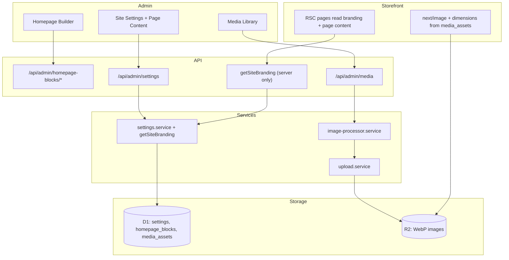

# CMS + Dynamic Content + WebP Image Pipeline — Plan

> **Goal:** Make storefront **content and images editable from the admin dashboard**, with **automatic WebP conversion** on every upload — and wire that CMS into **conversion / merchandising** so marketing can create urgency and excitement without a deploy.  
> **Status:** Planning document — no implementation yet.  
> **Related docs:** `BUSINESS-PLAN.md` (§4 CRO, §5 UGC), `docs/backend/08-admin-dashboard.md`, `docs/backend/10-enhancements.md` (§11 media, §17 homepage, §18 settings), `docs/performance-seo-plan.md`, `API.md`.

---

## 1. Executive summary

Today Zaya is **half dynamic**:

| Layer | Dynamic today | Still static |
| --- | --- | --- |
| **Catalog** | Products, categories, prices, stock (D1) | — |
| **Homepage** | Block builder (`homepage_blocks`, flag ON) | Classic home JSX fallback is hardcoded |
| **Branding / contact** | Keys exist in `settings` (admin editable): `site_name`, `logo_url`, `footer_text`, `whatsapp_number`, `contact_email`, `contact_phone`, SEO defaults | Storefront ignores them — reads from `SITE` constant + hardcoded values |
| **Marketing pages** | — | About, Contact, Privacy, Terms, Cookies (all static JSX) |
| **Bridal** | 7 section-level visibility toggles via `getBridalPageConfig()` | Bridal landing copy is static JSX |
| **CRO chrome** | Instagram handle + post URLs exist in settings | Announcement bar hardcoded; UGC wall not on storefront; social links missing from Footer |
| **Images** | R2 + `media_assets` library + pickers | No resize/WebP pipeline; `width`/`height` stored as `null`; no short product video |

**Core problem (infra):** The admin settings system stores branding, contact, and SEO values — but the storefront components don't read them. The biggest win is wiring what already exists.

**Core problem (sales):** `BUSINESS-PLAN.md` §4 needs a rotating announcement bar, Shop-the-vibe tiles, UGC/Instagram proof, and weekly hero/collection swaps — that is CMS work tied to **conversion**, not only “editable About pages.”

**Recommended approach:**

1. Extend existing patterns (`settings` KV, `homepage_blocks`, `media_assets`) — no third-party headless CMS.
2. Stay on Cloudflare (D1 + R2 + Workers).
3. **Bridge CMS → CRO:** announcements, curated Instagram proof, and weekly collection swaps — while **reusing** existing product systems (bundles / pre-orders / social_proof flags) instead of rebuilding them inside the CMS.

---

## 2. Current state (audit)

### 2.1 Content surfaces

| Route / surface | File(s) | Content type | Dynamic? | Gap |
| --- | --- | --- | --- | --- |
| `/` classic home | `ClassicHome.tsx` | Hero copy, section titles, CTA links | ❌ JSX | Fallback when no homepage blocks |
| `/` block home | `HomeFromBlocks.tsx` | Hero, featured, collections, promos | ✅ `homepage_blocks` | Working — no change needed |
| `/about` | `src/app/about/page.tsx` | Story, mission, values, placeholder image | ❌ | All copy hardcoded in JSX |
| `/contact` | `src/app/contact/page.tsx` | Intro, email, phone, FAQ | ❌ | Uses `support@Zaya.com` and `+20 123 456 7890` instead of settings values |
| `/privacy`, `/terms`, `/cookies` | `src/app/*/page.tsx` | Full legal prose | ❌ | Hardcoded HTML — `LegalPage` component exists for layout |
| `/bride` | `BridalLanding.tsx` | Tier copy, collection cards, SVG heroes | ⚠️ partial | Copy is static; 7 visibility toggles work via `getBridalPageConfig()` |
| Header announcement bar | `Header.tsx` L53–65 | Single static line (shipping / COD / drop copy mixed) | ❌ | Hardcoded — `BUSINESS-PLAN.md` wants **rotating**, clickable sales messages |
| Header logo / name | `Header.tsx` L73 | Site name text | ❌ | Reads `SITE.name` instead of `settings.site_name` |
| Footer | `Footer.tsx` | Site name, description, newsletter, links | ❌ | Reads `SITE.name`/`SITE.description`; **no social links section** (Instagram/Facebook/TikTok icons missing entirely) |
| WhatsApp FAB | `WhatsAppButton.tsx` | Phone number | ⚠️ prop | Accepts `phoneNumber` prop with default `'201090313619'`; `StorefrontChrome` renders it **without passing the prop** |
| Product descriptions | D1 `products.description` | Plain/HTML | ✅ data | No rich editor yet |
| Metadata | `layout.tsx`, per-page | Titles, descriptions, OG | ⚠️ | `seoDefaultTitle`/`seoDefaultDescription` exist in settings but `layout.tsx` reads `SITE` constant |

### 2.2 Existing admin building blocks (reuse)

| Feature | Admin UI | API | DB |
| --- | --- | --- | --- |
| Site settings | `/admin/settings` | `GET/PUT /api/admin/settings` | `settings` (key → JSON value) |
| Homepage builder | `/admin/homepage` | `/api/admin/homepage-blocks/*` | `homepage_blocks` |
| Media library | `/admin/media` | `/api/admin/media`, `/api/media/[...key]` | `media_assets` + R2 `UPLOADS` |
| Storefront config | — | `GET /api/storefront-config` | Subset of settings (threshold, zones, maintenance, payments, bridal) |

**Key gap:** Settings like `site_name`, `logo_url`, `footer_text`, `whatsapp_number`, `contact_email`, `contact_phone`, `social_instagram`, `social_facebook`, `social_tiktok`, `seo_default_title`, `seo_default_description` are **saved in D1** and **editable in admin** but **not consumed** by storefront components.

**Settings already available in `AdminSettingsDTO`** (from `admin-config.contract.ts`):

- `siteName`, `siteTagline`, `siteUrl`
- `logoUrl`, `faviconUrl`
- `contactEmail`, `contactPhone`, `whatsappNumber`
- `socialInstagram`, `socialFacebook`, `socialTiktok`
- `footerText`
- `seoDefaultTitle`, `seoDefaultDescription`
- `instagramHandle`, `instagramPostUrls` — UGC data already collectable in admin; **not rendered** as a homepage / PDP wall yet

**Already built for merchandising (do not rebuild in CMS):**

| Capability | Status | Flag / surface |
| --- | --- | --- |
| Bundles ("Buy 2 Get 1") | Admin + API exist | `bundles` (default OFF) |
| Pre-orders + ETA | Admin + API exist | `preorders` (default OFF) |
| Social proof section | Storefront component exists | `social_proof` (default OFF) |
| Homepage collection / hero / promo blocks | Admin builder + storefront | `homepage_builder` (ON) |

CMS should **feature and style** these (homepage widgets, badges, curated posts) — not reimplement pricing/stock logic.

### 2.3 Image upload flow (today)

```
Admin/Product/Category/Bridal form
  → multipart File
  → upload.service.ts (putCatalogImage | putBridalUpload | putRemoteCatalogImage)
  → R2 UPLOADS (original bytes, original mime)
  → URL /api/media/{key}
  → optional media_assets row (width/height/alt = null)
```

- **Max size:** 5 MB catalog, 25 MB bridal  
- **Accepted:** any `image/*` including WebP (stored as-is)  
- **No conversion, no resize, no dimension extraction**  
- **Temu import** (`putRemoteCatalogImage`) also stores originals unchanged  
- **Serve route:** streams R2 bytes with long cache; no on-the-fly transform  
- **`uploadAdminMedia`** inserts row with `width: null, height: null` — never populated

Relevant files:

- `src/server/services/upload.service.ts`
- `src/server/services/admin-media.service.ts`
- `src/app/api/media/[...key]/route.ts`
- `src/server/db/schema/media-assets.ts`

---

## 3. Target architecture

### 3.1 High-level diagram



### 3.2 Design principles

1. **Extend, don't replace** — Use existing `settings` KV for page content; keep `homepage_blocks` as-is.
2. **Server is source of truth** — Storefront reads via services / RSC; no content in client bundles except hydrated UI state.
3. **Sanitize all rich text** — Allow-list HTML on write (server); never trust admin paste blindly.
4. **Media references by ID** — Prefer `mediaAssetId` over raw URL strings so alt/dimensions stay linked.
5. **No page CMS at launch** — About, Contact, Privacy, Terms, and Cookies stay static; build structured page content only when regular publishing proves the need.
6. **Homepage builder stays the merchandising CMS** — Keep it separate from legal/about pages and use its existing hero, collection, and promo blocks. Marketing swaps heroes weekly there — that is the “Shop-the-vibe” engine.
7. **CMS sells; catalog decides** — Urgency badges (sold out / pre-order / bundle) read stock + flags from product services; CMS only places and words the modules.
8. **Media is safe by construction** — validate decoded bytes and pixel limits, not just browser-supplied MIME types; all deletion must be reference-aware.

---

## 4. Content strategy — detailed design

### 4.1 Content inventory (what to make dynamic)

#### Tier A — Wire existing settings to storefront (Phase 0)

These settings **already exist** in DB and admin UI — they just need to be consumed by storefront components:

| Content | Settings key(s) | Component to update |
| --- | --- | --- |
| Site name, tagline | `site_name`, `site_tagline` | `layout.tsx`, `Header.tsx`, `Footer.tsx` |
| Logo | `logo_url` | `Header.tsx` |
| Favicon | `favicon_url` | `layout.tsx` metadata |
| Footer text / description | `footer_text` | `Footer.tsx` |
| Social links | `social_instagram`, `social_facebook`, `social_tiktok` | `Footer.tsx` (add social icons section) |
| Contact email, phone | `contact_email`, `contact_phone` | `contact/page.tsx` |
| WhatsApp number | `whatsapp_number` | `StorefrontChrome.tsx` → pass as prop to `WhatsAppButton` |
| SEO defaults | `seo_default_title`, `seo_default_description` | `layout.tsx` metadata |
| Announcement bar | New: `announcement_items` (JSON array) — see §4.1.1 | `Header.tsx` (replace hardcoded copy) |

**Implementation:** Create `getSiteBranding()` in `settings.service.ts` that reads these keys in a single batch. Call it from RSC layout/pages. Fallback to `SITE` constant if DB empty.

#### 4.1.1 Announcement bar = sales engine (not a static string)

`BUSINESS-PLAN.md` §4 calls for a **rotating** bar: *"Free shipping over 1,500 EGP" · "COD available" · "New drop every week"* — low-key urgency on every page.

Do **not** ship a single `announcement_text` field as the end state. Model:

```ts
// settings key: announcement_items
type AnnouncementItem = {
  id: string;
  text: string;           // max ~80 chars
  href?: string;          // /shop/jewelry, /promos/..., external allowed with validation
  active: boolean;
  sortOrder: number;
  // V1: NO startsAt / endsAt — manual active toggle only (scheduling is deferred)
};
```

| Rule | Detail |
| --- | --- |
| Rotate client-side | Cycle every ~4–5s; pause on hover/focus; respect `prefers-reduced-motion` (show first item only) |
| Clickable | Entire strip is a link when `href` set → drive traffic to collections / free-shipping / new-in |
| Cap | Max 5 active items (keep the bar calm, not a ticker of spam) |
| Admin UX | Settings → Announcements: reorder list, toggle active, optional href |
| No scheduling in V1 | No `startsAt`/`endsAt` — keeps schema + Header simple; schedule only when promos need auto on/off |
| Seed defaults | Match current Header copy + free-shipping + COD lines from business plan |

Phase 0 can seed 1–3 items from current hardcoded strings so chrome stays populated while the rotator ships.

#### Tier B — Conversion & merchandising (Phase 2 — see §8)

These map directly to `BUSINESS-PLAN.md` sales tactics. Build after chrome and WebP, but treat them as part of the CMS plan (not a vague “later nice-to-have”).

| Content | Storage / surface | Business intent |
| --- | --- | --- |
| Rotating announcement items | `announcement_items` settings | Urgency + deep links to high-intent pages |
| Shop-the-vibe collection tiles | Existing homepage `collection` blocks + MediaPicker | Weekly visual freshness; TikTok-language tiles (Korean / Coquette / Everyday) |
| UGC / Instagram wall | Existing social-proof surface consumes curated `instagram_*` settings | Trust + cheapest acquisition channel without an Instagram API or a new block type |
| Bundle / pre-order placement | Existing homepage promo blocks link to existing bundle/pre-order routes | AOV + scarcity — catalog flags own logic |

#### Tier C — Only if needed later

| Content | Trigger to build |
| --- | --- |
| Blog / style guides | When marketing needs regular publishing |
| Campaign landing pages | When running paid ads with custom URLs |
| `pages` + `page_blocks` tables | When settings-based approach becomes unwieldy (>10 pages) |
| Announcement scheduling (`startsAt` / `endsAt`) | When promos need auto-start/stop without a human |
| Category hero banners | When category pages get redesigned |
| Editable About / legal pages | When content changes often enough to justify sanitization, publishing, and revision workflow |
| On-site product video / styling notes | After real photos, core CRO, and the review-submit flow are live; use Instagram/TikTok links in the meantime |

### 4.2 Storefront integration

1. **Server-side branding read** (new function in `settings.service.ts`):

   ```ts
   export async function getSiteBranding(): Promise<SiteBrandingDTO> {
     const keys = [
       'site_name', 'site_tagline', 'logo_url', 'favicon_url',
       'contact_email', 'contact_phone', 'whatsapp_number',
       'social_instagram', 'social_facebook', 'social_tiktok',
       'footer_text', 'seo_default_title', 'seo_default_description',
       'announcement_items', // AnnouncementItem[] — rotating sales engine
     ];
     // One D1 `WHERE key IN (...)` query, then map values by key.
     // Do not make one query per setting on every RSC render.
     const values = await getSettingsByKeys(keys);
     // ... map to DTO with SITE constant fallbacks
   }
   ```

2. **Layout** (`src/app/layout.tsx`):

   - Server-read `getSiteBranding()` for name, tagline, default SEO.
   - Fallback to `SITE` constant if DB empty (bootstrap safety).

3. **Caching:** Settings/homepage/media writes must invalidate the affected route or cache tag. This is required because branding is read directly by the root layout.

### 4.3 Explicitly out of scope for now

About, Privacy, Terms, and Cookies remain static JSX. They change infrequently and a page editor adds sanitization, publishing, revision, RBAC, and support burden that does not advance the launch goals. Contact details already become dynamic in Phase 0 through the existing settings. Revisit page editing only for frequent content changes, a blog, or paid campaign landing pages.

---

## 5. WebP image pipeline — detailed design

### 5.1 Requirements

| Requirement | Detail |
| --- | --- |
| Auto WebP | Every catalog/library/product/category upload → store **primary asset as WebP** |
| Quality | Default quality 82–85 (tune per profile: product vs hero) |
| Max dimension | Cap longest edge (e.g. 2048px product, 2560px hero) — configurable in settings |
| Metadata | Populate `width`, `height`, `size`, `mime=image/webp` on `media_assets` |
| Alt text | Required on upload in media library; optional elsewhere with warning |
| SVG | **Do not convert** — store as-is (placeholders/icons) |
| GIF (catalog stills) | Convert **first frame** to static WebP for product stills (smaller, cacheable) |
| Bridal private uploads | Images → WebP for staff preview; video unchanged; keep 25 MB input limit |
| Temu import | Convert images after fetch in `putRemoteCatalogImage` |
| Backward compat | Existing PNG/JPG URLs keep working; optional batch migration job |

### 5.2 Processing flow (target)

```
Upload (JPEG/PNG/HEIC/WebP/GIF)
  → validate magic bytes + decode capability + size + max decoded pixels
  → image-processor.service
       decode → auto-orient (EXIF) → resize if > maxEdge → encode WebP
  → R2: library/{id}.webp  (single optimized file)
  → media_assets row (mime=image/webp, size, width, height, alt)
  → return { url, width, height }
```

No responsive-variant system in V1. Storefront uses `next/image` with **`images.unoptimized: true`** so Workers never re-encode, and passes known dimensions/sizes to avoid layout shift. Revisit variants only when real-device metrics show image payloads harming LCP.

### 5.3 Implementation: WASM encoder in Worker

Use `@jsquash/webp` (or `photon-wasm`) to convert images synchronously in the upload handler, subject to a Phase 1 compatibility spike.

**Why this approach:**
- No extra service — runs in the existing upload Worker
- Full control at upload time — no delayed availability
- Fits the current R2 + `/api/media` URL pattern
- CPU/memory limits are manageable for ≤5 MB inputs with resize-before-encode and a decoded-pixel ceiling

**Risk mitigation:** Verify actual decoder support for JPEG, PNG, WebP, HEIC, and GIF before promising them in the UI; reject unsupported formats with a clear message. Enforce magic-byte checks, a decoded-pixel ceiling, and a streamed remote-download cap. If a large file hits Worker CPU limits, reject with error and suggest reducing image size before upload. Add a queue-based fallback (Cloudflare Queue + Consumer Worker) if the spike shows synchronous processing is unreliable.

### 5.4 Integration point in `admin-media.service.ts`

The WebP processor integrates inside `uploadAdminMedia`, replacing the current raw upload:

```ts
// Current (admin-media.service.ts line 54):
const uploaded = await putCatalogImage(folder?.trim() || 'library', file);
// ...
width: null,
height: null,

// Target:
const processed = await processUpload(file, 'library'); // → { bytes, width, height, mime }
const uploaded = await putProcessedImage(folder?.trim() || 'library', processed);
// ...
width: processed.width,
height: processed.height,
```

Same change applies to:
- Product/category image upload routes
- `putRemoteCatalogImage` (Temu import)
- Bridal uploads (images only, not video)

### 5.5 `image-processor.service.ts` (sketch)

Responsibilities:

- `processUpload(file: File, profile: 'product' | 'hero' | 'library'): Promise<ProcessedImage>`
- Profiles define `maxEdge`, `quality`, `allowAnimated`
- Strip EXIF (privacy) except orientation before strip
- Reject: invalid magic bytes, unsupported decoder input, excessive decoded pixels, and oversized input; SVG passes through unchanged
- Return `{ bytes, width, height, mime: 'image/webp', extension: 'webp' }`

Profiles:

| Profile | Max edge | Quality | Use case |
| --- | --- | --- | --- |
| `product` | 2048px | 82 | Product images, category images |
| `hero` | 2560px | 85 | Homepage hero, banner images |
| `library` | 2048px | 82 | General media library uploads |

### 5.6 Delivery & SEO

- All product/content `` via `next/image` with known `width`/`height` → **CLS fix**.
- **`next/image` config (locked):** set `images.unoptimized: true` in `next.config.ts`.
  - **Why:** Upload pipeline already resizes + encodes WebP in the Worker. On Cloudflare (OpenNext Workers), the default Next image optimizer either fails or re-processes bytes and burns CPU for no gain.
  - **Not V1:** custom image loaders / on-the-fly Cloudflare Images transforms — revisit only if we need responsive variants without storing multiple files.
- Still pass `width` / `height` / `sizes` to `next/image` for layout stability even with `unoptimized`.
- OG images: ensure ≥ 1200×630 — processor can expose `og` profile crop.
- Cache headers unchanged: immutable WebP at stable URL.

### 5.7 Migration job

Admin action or script to convert existing images:

```
POST /api/admin/media/migrate-to-webp
  → dry-run or resumable cursor-based batch
  → scan media_assets where mime != 'image/webp' AND mime != 'image/svg+xml'
  → for each: fetch R2 → convert → write new key → verify → update row → log outcome
  → delete old key only after the new asset and database update succeed
```

Do not build this in V1. Existing assets can continue to work, and new uploads receive WebP. Add a resumable migration job later only if legacy images materially hurt performance.

---

## 6. API surface (new / changed)

### Server-only (new function, not an API route)

| Function | Description |
| --- | --- |
| `getSiteBranding()` | Reads branding settings for RSC layout/pages — called server-side only |

### Admin (changes to existing)

| Method | Path | Description |
| --- | --- | --- |
| PUT | `/api/admin/settings` | **Extend:** accept validated `announcement_items` |
| POST | `/api/admin/media` | **Response change:** includes `width`, `height`, `mime: image/webp` |
| PUT | `/api/admin/media/:id` | **New:** update alt text |

Infra scope: no new public CMS endpoints; only settings/media extensions.

---

## 7. Feature flags & settings

### New settings

```ts
announcement_items  // AnnouncementItem[] — rotating, clickable sales bar (see §4.1.1)
```

WebP conversion doesn't need a feature flag — once deployed, still uploads go through the processor. A processing failure returns a clear error; it must never silently store an unoptimized asset.

### Existing feature flags (flip when Phase 3 ships)

| Flag | Role in CMS / CRO |
| --- | --- |
| `homepage_builder` | Hero + collection + promo blocks — already ON |
| `social_proof` | Gate UGC / Instagram wall + review band |
| `bundles` | Existing bundle pages/PDP badges |
| `preorders` | Pre-order ETA badge + “notify / reserve” merchandising |

No new flag required for announcements or WebP.

---

## 8. Implementation phases

### Phase 0 — Wire existing settings + announcement engine (~1–1.5 days)

- [ ] Create `getSiteBranding()` in `settings.service.ts` — batch-read branding keys
- [ ] Update `layout.tsx` — site name, tagline, SEO defaults from settings (fallback to `SITE`)
- [ ] Update `Header.tsx` — logo from `logoUrl`; **rotating** announcements from `announcement_items`
- [ ] Update `Footer.tsx` — site name/description; social icons (Instagram, Facebook, TikTok)
- [ ] Update `StorefrontChrome.tsx` — pass `whatsappNumber` to `WhatsAppButton`
- [ ] Update `contact/page.tsx` — `contactEmail` / `contactPhone` / WhatsApp from settings
- [ ] Admin settings UI: Announcements list editor (text, href, active, reorder)
- [ ] Seed `announcement_items` from current Header copy + free-shipping + COD lines
- [ ] Invalidate the affected route/cache tag after settings, homepage, or media writes
- [ ] Allow internal announcement paths by default; require explicit validation for external links

### Phase 1 — WebP stills pipeline (~2–3 days)

- [ ] Choose WASM library; spike in Worker for decoder support, 5 MB JPEG conversion time/memory, and decoded-pixel limits
- [ ] `image-processor.service.ts` + unit tests with fixture buffers
- [ ] Validate magic bytes, decoder support, decoded pixels, and remote-fetch size/redirects before processing
- [ ] Integrate in `uploadAdminMedia` — replace `putCatalogImage` with process + upload
- [ ] Integrate in product/category image routes + Temu import
- [ ] Admin media UI: dimensions badge, mime type, alt text edit
- [ ] Lock `images.unoptimized: true` in `next.config.ts` (no custom loader in V1 — §5.6)
- [ ] Do not migrate existing images in V1; new uploads receive WebP and legacy URLs continue to work

### Phase 2 — Conversion wiring (~1–2 days)

- [ ] Announcement bar a11y: pause on hover, reduced-motion, keyboard focus
- [ ] Verify Lighthouse: LCP image has explicit dimensions, no layout shift

### Phase 3 — Conversion & merchandising (~1–2 days) ⭐ sales engine

Maps to `BUSINESS-PLAN.md` §4–§5. Goal: marketing can refresh the storefront weekly and push purchase intent without engineering.

#### 3a — Shop-the-vibe + hero ops

- [ ] Ensure homepage `hero` + `collection` / `promo` blocks always pick media via **MediaPicker** (`mediaAssetId` preferred over raw URL)
- [ ] Admin checklist doc: “Monday drop ritual” — swap hero image + vibe tiles in &lt;10 minutes
- [ ] Keep two CTAs on hero (`Shop New In` / `Best Sellers`) editable in block config (already partially modeled)

#### 3b — UGC / Instagram wall

- [ ] Enable the existing social-proof section from settings: grid of curated posts
- [ ] Consume `instagramHandle` + `instagramPostUrls` (already in settings) — admin curates URLs / covers from media library
- [ ] Embed strategy: cover image (WebP) + link-out to Instagram (no fragile official API required for v1)
- [ ] Gate render with `social_proof` flag; place on home + optional PDP “Worn by you” strip
- [ ] Later: accept customer photo/video uploads (review photos) — after storefront review-submit UI lands

#### 3c — Bundles & pre-order urgency widgets

- [ ] Use existing promo blocks to link to the existing bundles surface when `bundles` is ON
- [ ] Product card / PDP badges driven by **catalog data**, not copy pasted in CMS: Sold out → Pre-order ETA when `preorders` ON; Bundle deal chip when product in active bundle
- [ ] Do **not** store sell prices or stock rules in CMS config

#### 3d — Success metrics (from business plan)

Track whether CMS CRO modules move the needle (admin stats already partial):

- Announcement click-through (simple event or UTM on `href`)
- Homepage vibe tile CTR
- UGC block CTR → Instagram / PDP
- Bundle attach rate when widget live

---

## 9. Future improvements (beyond Phase 3)

### 9.1 Media & performance

| Improvement | Why |
| --- | --- |
| **Responsive variants + `srcset`** | Add only if real-device LCP/image-transfer data shows the single WebP profile is insufficient |
| **Blur placeholder hash** (LQIP) | Store 20×20 base64 in `media_assets` |
| **AVIF with WebP fallback** | ~20% smaller than WebP |
| **Smart crop focal point** | Hero / vibe tiles stay product-forward after crop |
| **Duplicate detection** (perceptual hash) | Avoid identical product upload duplicates |
| **On-site product video** | Add only after real photography, core CRO, and review submission are live; Instagram/TikTok remains the video channel for launch |

### 9.2 SEO, i18n & trust

| Improvement | Why |
| --- | --- |
| **Review photo UGC** in grid | Closes referral loop from `BUSINESS-PLAN.md` §5 |

### 9.4 Scale triggers (when to build `pages` table)

Build a proper `pages` + `page_blocks` system **only when:**

- You need >10 editable pages
- You need reusable blocks across pages (shared hero, shared CTA)
- You need a blog or campaign landing page builder
- Non-developers need to create new pages without a deploy

Until then, static marketing/legal pages plus the existing settings and **homepage_blocks** remain sufficient.

---

## 10. Risks & mitigations

| Risk | Mitigation |
| --- | --- |
| Worker CPU timeout / decompression bomb | Check magic bytes and decoded-pixel limits; spike real Worker CPU/memory; reject safely if limits are exceeded |
| WASM bundle size | Dynamic import processor only in upload routes |
| Unsupported image decoder | Confirm format support in the Phase 1 spike; clearly reject unsupported formats rather than accepting unreliable uploads |
| Double-optimize images on Workers | Locked: `images.unoptimized: true` — upload pipeline owns WebP (§5.6) |
| CMS reinventing bundles/stock | Blocks only **reference** bundle IDs / product IDs; inventory stays in services |
| Announcement spam | Cap 5 active items; no emoji flood in defaults; links required for promo claims when possible |
| Fragile Instagram embeds | v1 = curated cover + outbound link; upgrade to API later only if needed |

---

## 11. Verification checklist

After each phase:

```bash
pnpm build && pnpm typecheck && pnpm lint && pnpm assert:no-secrets
```

Manual:

**Phases 0–2 (infra + conversion wiring)**

- [ ] Logo / footer / WhatsApp / social links come from admin settings
- [ ] Announcement bar rotates ≥2 items; click opens configured `href`; reduced-motion shows first only
- [ ] Contact page shows email/phone from settings
- [ ] Upload PNG/JPEG → WebP; `width`/`height` populated
- [ ] Delete referenced media → blocked

**Phase 3 (conversion)**

- [ ] Marketing can swap homepage hero + vibe tiles via MediaPicker without deploy
- [ ] Existing social-proof section shows curated posts when `social_proof` ON; hidden when OFF
- [ ] Bundle links are shown only when `bundles` is ON
- [ ] Sold-out / pre-order badge matches real product state (`preorders` flag)

---

## 12. Locked decisions + remaining questions

### Locked for V1 (do not reopen during Phase 0–3)

| # | Topic | Decision |
| --- | --- | --- |
| 1 | Page editor | **Out of scope.** Keep the five static marketing/legal pages in JSX until frequent publishing creates a real need. |
| 2 | `next/image` | **`images.unoptimized: true`** always. The upload pipeline owns WebP; reconsider responsive variants only from production metrics. |
| 3 | Announcement scheduling | **No `startsAt`/`endsAt`.** Manual `active` + reorder only. |
| 4 | WebP originals | **WebP-only storage** (drop originals after convert) to save R2. Re-upload if reprocess is needed. |
| 5 | Bridal customer uploads | Images → WebP for staff preview; video unchanged. |

### Still open (decide after Phase 3 proves demand)

| # | Topic | Options |
| --- | --- | --- |
| A | UGC v1 | Curated cover + Instagram link-out (**lean default**) vs third-party embed widget |

---

## 13. File map (planned changes)

| Area | Files to modify/create |
| --- | --- |
| Services | `settings.service.ts` (`getSiteBranding`, `announcement_items`) |
| Services | `image-processor.service.ts` **(NEW)** |
| Services | `admin-media.service.ts`, `upload.service.ts` (`putProcessedImage`) |
| Homepage | Existing hero / collection / promo blocks and the existing social-proof surface |
| Contracts | `admin-config.contract.ts` (`SiteBrandingDTO`, `AnnouncementItem`) |
| Layout / chrome | `layout.tsx`, `Header.tsx` (rotator), `Footer.tsx`, `StorefrontChrome.tsx` |
| Config | `next.config.ts` — **`images.unoptimized: true`**; flip `social_proof` / `bundles` / `preorders` when ready |

---

## 14. Verdict on CRO-oriented CMS suggestions

These ideas (from sales/CRO review) were **accepted into this plan** with scope boundaries:

| Suggestion | Verdict | How we use it |
| --- | --- | --- |
| Rotating clickable announcement bar | ✅ Adopt | `announcement_items` — Phase 0 (§4.1.1) |
| Urgency / bundle / pre-order modules | ✅ Adopt carefully | Existing promo links + catalog-driven badges; do not build commerce rules into CMS |
| Instagram / UGC wall | ✅ Adopt | Curated settings in the existing social-proof surface; no new homepage block or live Instagram API |
| Short video / motion for storytelling | ⏸ Defer | Use Instagram/TikTok at launch; on-site video is not required for initial conversion |
| Localized trend / “How to wear” copy | ⏸ Defer | Improve product descriptions manually before adding product-schema fields |
| Shop-the-vibe weekly hero swaps | ✅ Adopt | Existing homepage collection blocks + MediaPicker |

**Rejected / deferred as CMS scope:** rebuilding stock rules, pricing, or bundle calculation inside block JSON; fragile live Instagram API scraping; hosted product video; and a page-editor system for five mostly-static pages.

### Final polish accepted (implementation hygiene)

| Tweak | Verdict | Where |
| --- | --- | --- |
| Mandate `images.unoptimized: true` | ✅ Locked | §5.6, Phase 1 |
| No announcement date scheduling in V1 | ✅ Locked | §4.1.1, §12 |

**Phase 0 gate:** plan is lean enough to execute — start with `getSiteBranding()` + wire settings into Header / Footer / contact / WhatsApp + `announcement_items` rotator.
